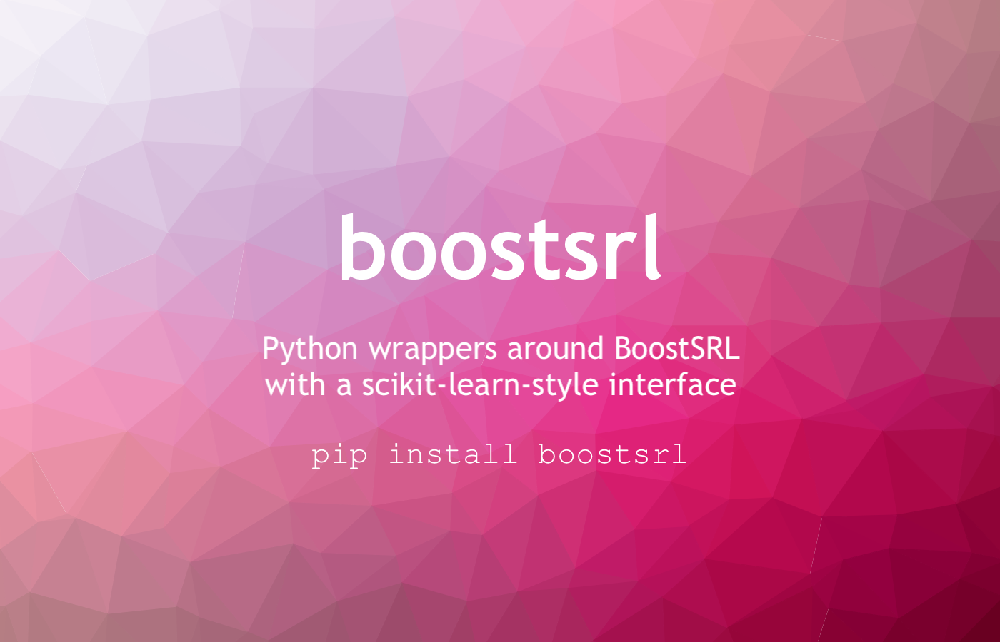

########
srlearn
########

|License|_ |LGTM|_ |GitHubBuilds|_ |Codecov|_ |ReadTheDocs|_

.. |License| image:: https://img.shields.io/github/license/srlearn/srlearn.svg
    :alt: License
.. _License: LICENSE

.. |LGTM| image:: https://img.shields.io/lgtm/grade/python/github/srlearn/srlearn?label=code%20quality&logo=lgtm
    :alt: LGTM code quality analysis
.. _LGTM: https://lgtm.com/projects/g/srlearn/srlearn/context:python

.. |GitHubBuilds| image:: https://github.com/srlearn/srlearn/actions/workflows/python_tests.yml/badge.svg
    :alt: GitHub CI Builds
.. _GitHubBuilds: https://github.com/srlearn/srlearn/actions/workflows/python_tests.yml

.. |Codecov| image:: https://codecov.io/gh/srlearn/srlearn/branch/main/graphs/badge.svg?branch=main
    :alt: Code coverage status
.. _Codecov: https://codecov.io/github/srlearn/srlearn?branch=main

.. |ReadTheDocs| image:: https://readthedocs.org/projects/srlearn/badge/?version=latest
    :alt: Documentation status
.. _ReadTheDocs: https://srlearn.readthedocs.io/en/latest/

Introduction
------------

srlearn is a project and set of packages for
*statistical relational artificial intelligence.*

*Standard* machine learning tends to focus on learning and inference inside of
a *feature-vector* (fit a model such that :math:`\boldsymbol{X}` predicts :math:`y`).
*Statistical Relational Learning* attempts to generalize this to
arbitrary graph and hypergraph data: where the prediction problem may include
a set of objects with attributes and relations on those objects.

.. code-block:: python

    from srlearn.rdn import BoostedRDNClassifier
    from srlearn import Background
    from srlearn.datasets import load_toy_cancer
    train, test = load_toy_cancer()
    bk = Background(modes=train.modes)
    clf = BoostedRDNClassifier(
        background=bk,
        target='cancer',
    )
    clf.fit(train)
    clf.predict_proba(test)
    # array([0.88079619, 0.88079619, 0.88079619, 0.3075821 , 0.3075821 ])
    print(clf.classes_)
    # array([1., 1., 1., 0., 0.])

.. toctree::
   :hidden:
   :maxdepth: 2
   :caption: Getting Started

   getting_started

.. toctree::
   :hidden:
   :maxdepth: 2
   :caption: Documentation

   user_guide
   api

.. toctree::
   :hidden:
   :maxdepth: 1
   :caption: Example Gallery

   auto_examples/index

.. toctree::
  :hidden:
  :caption: Links

  StARLinG Lab 🔗 <https://starling.utdallas.edu/>
  GitHub 🔗 <https://github.com/hayesall/srlearn/>
  PyPi 🔗 <https://pypi.org/project/srlearn/>

Questions? Contact `Alexander L. Hayes <https://hayesall.com>`_ (hayesall@iu.edu)

`Getting started <getting_started.html>`_
-----------------------------------------

Prerequisites and installation instructions for getting started with
this package.

`User guide <user_guide.html>`_
-------------------------------

Guide to instantiate, parametrize, and invoke the core methods using a built-in data set.

`API documentation <api.html>`_
-------------------------------

Full documentation for the modules.

`Example gallery <auto_examples/index.html>`_
---------------------------------------------

A gallery of examples with figures and expected outputs.
It complements and extends past the basic example from the `User Guide <user_guide.html>`_.

Citing
------

If you find this helpful in your work, please consider citing:

.. code-block:: bibtex

  @misc{hayes2019srlearn,
    title={srlearn: A Python Library for Gradient-Boosted Statistical Relational Models},
    author={Alexander L. Hayes},
    year={2019},
    eprint={1912.08198},
    archivePrefix={arXiv},
    primaryClass={cs.LG}
  }

Contributing
------------

Many thanks to those who have already made contributions:

- `Alexander L. Hayes <https://hayesall.com>`_, *Indiana University, Bloomington*
- `Harsha Kokel <https://harshakokel.com/>`_, *The University of Texas at Dallas*
- `Siwen Yan <https://dtrycode.github.io/>`_, *The University of Texas at Dallas*

Many thanks to the known and unknown contributors to WILL/BoostSRL/SRLBoost,
including: Navdeep Kaur, Nandini Ramanan, Srijita Das, Mayukh Das, Kaushik Roy,
Devendra Singh Dhami, Shuo Yang, Phillip Odom, Tushar Khot, Gautam Kunapuli,
Sriraam Natarajan, Trevor Walker, and Jude W. Shavlik.

We have adopted the `Contributor Covenant Code of Conduct <https://github.com/srlearn/srlearn/blob/main/.github/CODE_OF_CONDUCT.md>`_ version 1.4. Please read,
follow, and report any incidents which violate this.

Questions, Issues, and Pull Requests are welcome. Please refer to `CONTRIBUTING.md <https://github.com/srlearn/srlearn/blob/main/.github/CONTRIBUTING.md>`_ for
information on submitting issues and pull requests.
